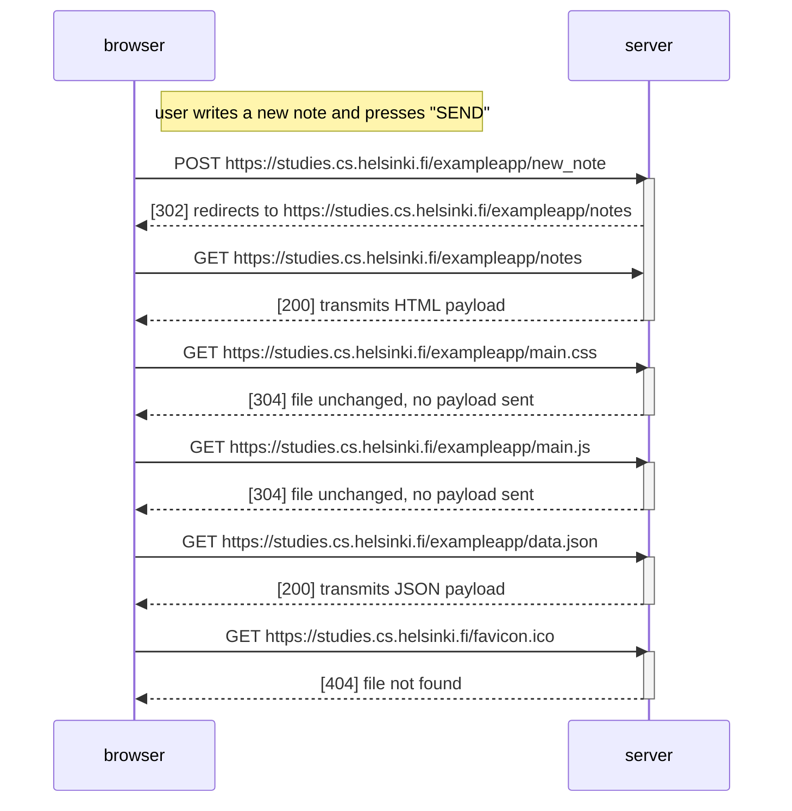

```mermaid
sequenceDiagram
    participant browser
    participant server

    Note right of browser: user writes a new note and presses "SEND"

    browser->>server:   POST https://studies.cs.helsinki.fi/exampleapp/new_note
    activate server
    server-->>browser:  [302] redirects to https://studies.cs.helsinki.fi/exampleapp/notes
    browser->>server:   GET https://studies.cs.helsinki.fi/exampleapp/notes
    server-->>browser:  [200] transmits HTML payload
    deactivate server

    browser->>server:   GET https://studies.cs.helsinki.fi/exampleapp/main.css
    activate server
    server-->>browser:  [304] file unchanged, no payload sent
    deactivate server

    browser->>server:   GET https://studies.cs.helsinki.fi/exampleapp/main.js
    activate server
    server-->>browser:  [304] file unchanged, no payload sent
    deactivate server

    browser->>server:   GET https://studies.cs.helsinki.fi/exampleapp/data.json
    activate server
    server-->>browser:  [200] transmits JSON payload
    deactivate server

    browser->>server:   GET https://studies.cs.helsinki.fi/favicon.ico
    activate server
    server-->>browser:  [404] file not found
    deactivate server

```
