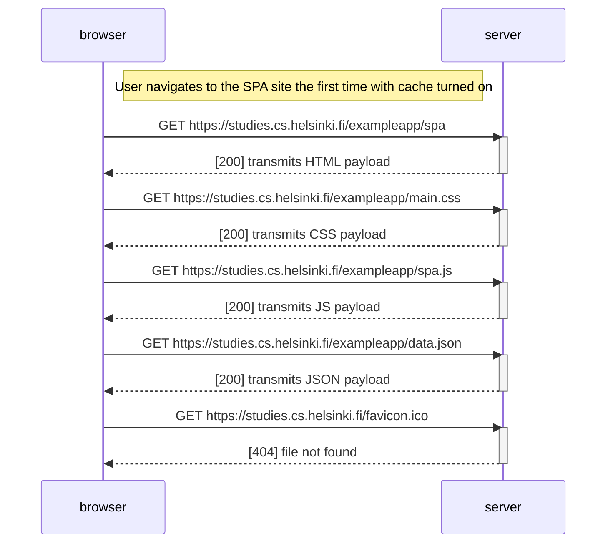

```mermaid
sequenceDiagram
    participant browser
    participant server

    Note right of browser: User navigates to the SPA site the first time with cache turned on

    browser->>server:   GET https://studies.cs.helsinki.fi/exampleapp/spa
    activate server
    server-->>browser:  [200] transmits HTML payload
    deactivate server

    browser->>server:   GET https://studies.cs.helsinki.fi/exampleapp/main.css
    activate server
    server-->>browser:  [200] transmits CSS payload
    deactivate server

    browser->>server:   GET https://studies.cs.helsinki.fi/exampleapp/spa.js
    activate server
    server-->>browser:  [200] transmits JS payload
    deactivate server

    browser->>server:   GET https://studies.cs.helsinki.fi/exampleapp/data.json
    activate server
    server-->>browser:  [200] transmits JSON payload
    deactivate server

    browser->>server:   GET https://studies.cs.helsinki.fi/favicon.ico
    activate server
    server-->>browser:  [404] file not found
    deactivate server

```
