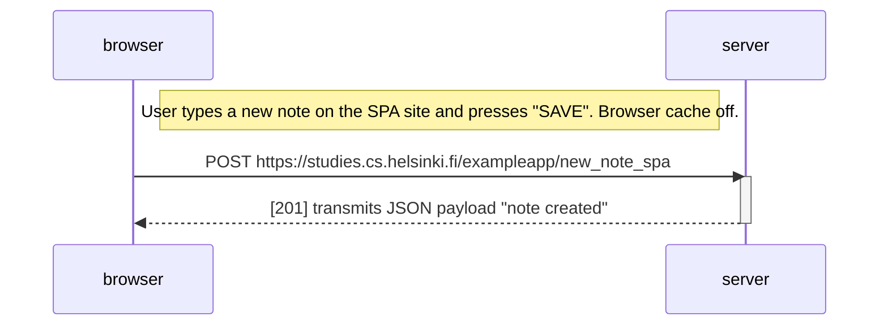

```mermaid
sequenceDiagram
    participant browser
    participant server

    Note right of browser: User types a new note on the SPA site and presses "SAVE". Browser cache off.

    browser->>server:   POST https://studies.cs.helsinki.fi/exampleapp/new_note_spa
    activate server
    server-->>browser:  [201] transmits JSON payload "note created"
    deactivate server

```
